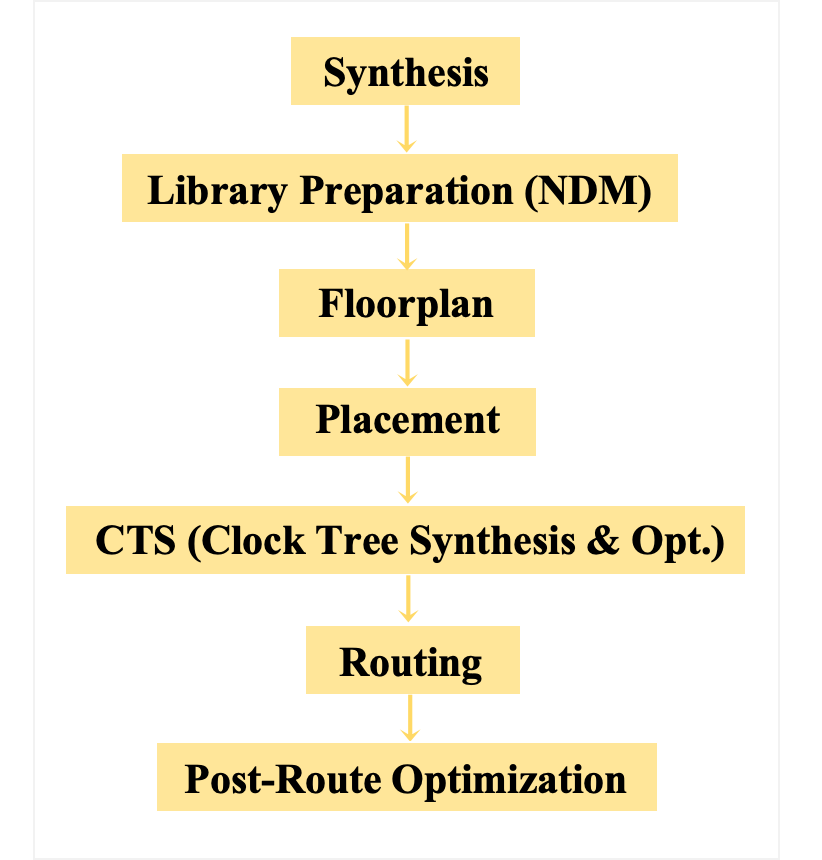
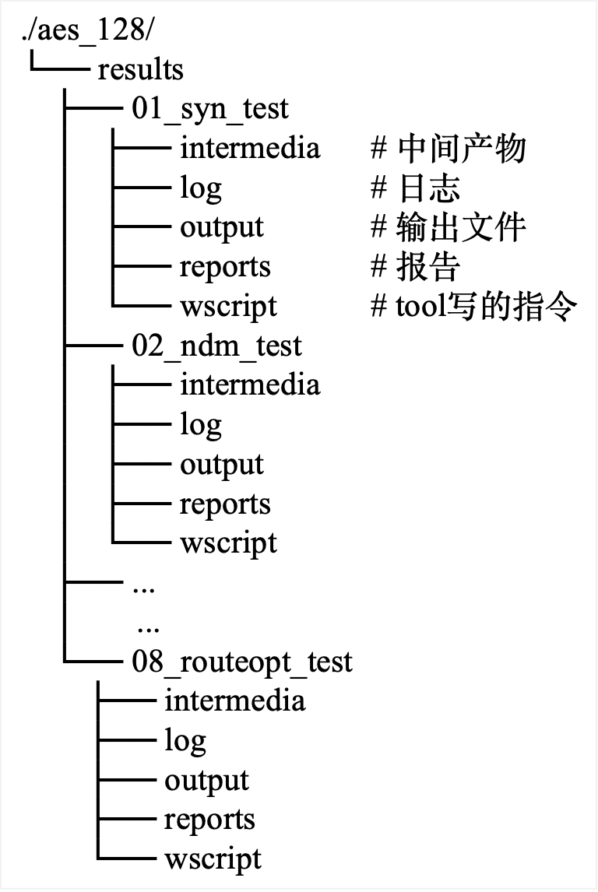
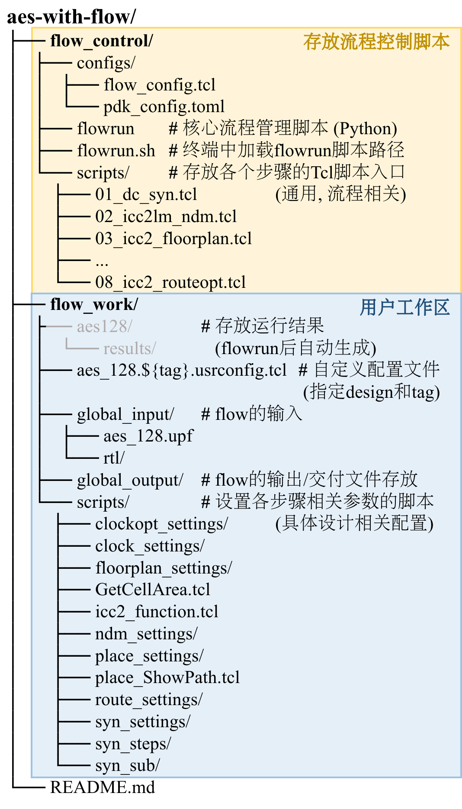

# AES-with-flow

## 一. 简介

本项目旨在对一个AES（Advanced Encryption Standard）加密模块进行从RTL到GDSII的数字后端实现. 核心步骤如图1:



<center style="color:#696969;text-decoration:underline">fig.1  flow流程</center>

## 二. 用法

### 2.1 进入工作区, 加载环境

克隆仓库, 进入aes-with-flow/, 进入flow_work工作区, 加载flowrun路径 (如果尚未加载).  

```bash
git clone /15T/public/prj/aes-with-flow
cd aes-with-flow
cd flow_work		# 进入aes-with-flow/flow_work/
source flowrun.sh	# 加载环境
```

输入以下命令将自动运行标识 (tag) 为test的整个流程:

```bash
flowrun -config aes_128.test.usrconfig.tcl -debug false
```

### 2.2 用`flowrun`指令开始流程

`flowrun`命令语法:

```bash
flowrun -config <DESIGN_NAME.TAG.usrconfig.tcl> [OPTIONS]
```

- **核心参数**: `-config` 是必需的，它指定了本次运行的设计名称、标签以及自定义配置。

	在运行一个完整流程之前, 你可以命名自己的`DESIGN_NAME.TAG.usrconfig.tcl`文件放在`flow_work/`中, 并在flowrun指令中通过-config参数将这个文件传递给Python控制程序, 程序会: 

	1. **解析`DESIGN_NAME.TAG.usrconfig.tcl`文件的名字**得到design name和这次运行的标识符tag; 
	2. **`DESIGN_NAME.TAG.usrconfig.tcl`中的命令**将在每个步骤的开头被source, 这个文件中的命令后于`flow_config.tcl`被source, 即**相对于默认设置具有更高的优先级**. 

- **可选参数**: `[OPTIONS]` 包括指定特定步骤 (`-steps`) 或开启调试模式 (`-debug`)

	1. `-steps`: 用作执行特定步骤, 步骤间用逗号`,`分隔. 不指定步骤即执行整个流程. 指定用的步骤名在`flow_control/configs/flow_config.tcl`中定义. 

		例如: `flowrun -config aes_128.test.usrconfig.tcl -steps 03_floorplan,04_place` 即为: 标识为test的流程中只执行floorplan和placement. 

	2. `-debug`: 设置成true/false, 默认true. 

		true时会在终端中输出运行的信息. 并在每步运行结束后不退出EDA的shell, 等待人工的后续指令. 

		false时会默默执行, 终端中只显示当前在执行的步骤, 运行完后自动退出到bash/zsh. 

		无论`-debug`设置何值, 均会在results中每一步子文件夹的log目录中记录运行日志. 

### 2.3 查看结果

在成功运行了这个后端流程后, 会在flow_work文件夹下自动生成`aes_128/results/`存放各个步骤的运行结果,  如图2, 可以在其中查找你想要的输出. 



<center style="color:#696969;text-decoration:underline">fig.2  生成的运行结果目录结构</center>

## 三. 原理

### 3.1 文件结构

这个工程采用名为flow_control的文件夹存放flow的控制脚本; 采用名为flow_work的文件夹存放各个步骤的参数配置脚本, 整个flow的输入输出以及运行结果, 如图3. 

在成功运行了这个后端流程后, 会在flow_work文件夹下自动生成aes_128/results/存放各个步骤的运行结果. 想要获取某一个步骤的结果, 可以在相应步骤的目录中 (例如results/01_syn_${tag}/output) 中得到. 



<center style="color:#696969;text-decoration:underline">fig.3  文件夹结构</center>

### 3.2 运行机制

当我们输入: 
```bash
flowrun -config aes_128.test.usrconfig.tcl -debug false
```

后, 会发生什么? 

可以阅读`flowrun`文件的源码. 大致分为: 

1. 解析`-config`传入的文件名得到design name和tag. 
1. 解析`flow_config.tcl`文件中存放的flow步骤.
1. 解析`pdk_config.toml`文件中存放的工艺角以及依赖相关文件路径/文件名. 
1. 定义并生成每一步的文件夹结构. 
1. 将上方1 - 4步得到的参数写入一个`flow_init.tcl`文件, 供各个步骤读取, 实现参数传入各个EDA工具的shell. 
1. 生成指令运行流程. 

## 四. 一些已知的注意事项

- 关于FLOW_CORE_NUM参数的设置:
	- 综合最大仅支持16核心运行, 这个参数是单独设置的, 叫做FLOW_CORE_NUM_SYN. 
	- 如果设置64核心, 则在执行06_clockopt中的clock_opt指令时, icc2会出现段错误, 应该是2018版本工具本身的一个并发bug, 结果会导致icc2崩溃. 经测试**32核心运行**不会出现这一问题. 
	- 32核心运行目前flow的时间是56 min左右 (不同设备上运行两次的均值). 
