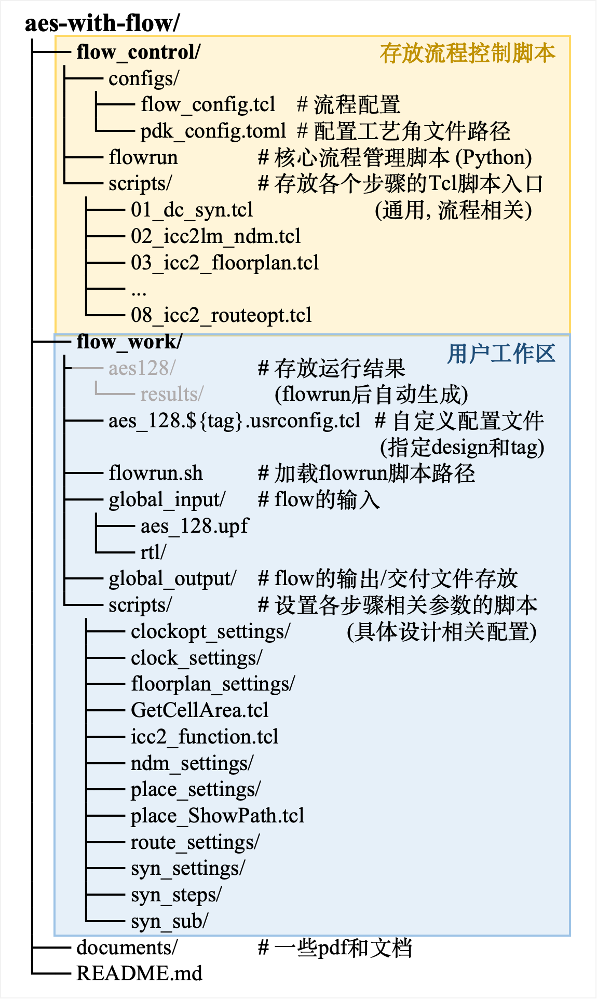

# AES-with-flow

[toc]

## 一. 简介

这个工程对一个AES模块进行了数字电路的后端实现. 

这个工程中flow的流程:


<center style="color:#696969;text-decoration:underline">fig.1  flow流程</center>

## 二. 用法

### 2.1 示例

克隆仓库, 进入aes-with-flow/, 进入flow_work工作区, 加载flowrun路径 (如果尚未加载).  

```bash
git clone 
cd aes-with-flow
cd flow_work		# 进入aes-with-flow/flow_work/
source flowrun.sh	# 加载环境
```

输入以下命令将自动运行标识 (tag) 为test的整个流程:

```bash
flowrun -config aes_128.test.usrconfig.tcl -debug false
```

### 2.2 `flowrun`命令语法:

```bash
flowrun -config <DESIGN_NAME.TAG.usrconfig.tcl> [OPTIONS]
```

**核心参数**: `-config` 是必需的，它指定了本次运行的设计名称、标签以及自定义配置。

**可选参数**: `[OPTIONS]` 包括指定特定步骤 (`-steps`) 或开启调试模式 (`-debug`)

## 三. 原理

### 1.2 文件结构

​	这个工程采用名为flow_control的文件夹存放flow的控制脚本; 采用名为flow_work的文件夹存放各个步骤的参数配置脚本, 整个flow的输入输出以及运行结果, 如图2. 在成功运行了这个后端流程后, 会在flow_work文件夹下自动生成aes_128/results/存放各个步骤的运行结果. 想要获取某一个步骤的结果, 可以在相应步骤的目录中 (例如results/01_syn_${tag}/output) 中得到. 



<center style="color:#696969;text-decoration:underline">fig.2  文件夹结构</center>

### 1.3 运行机制


